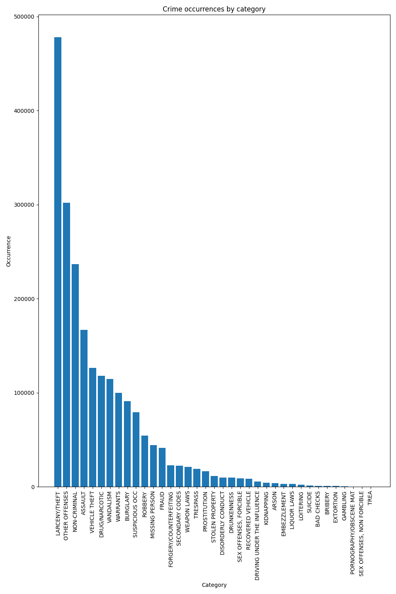
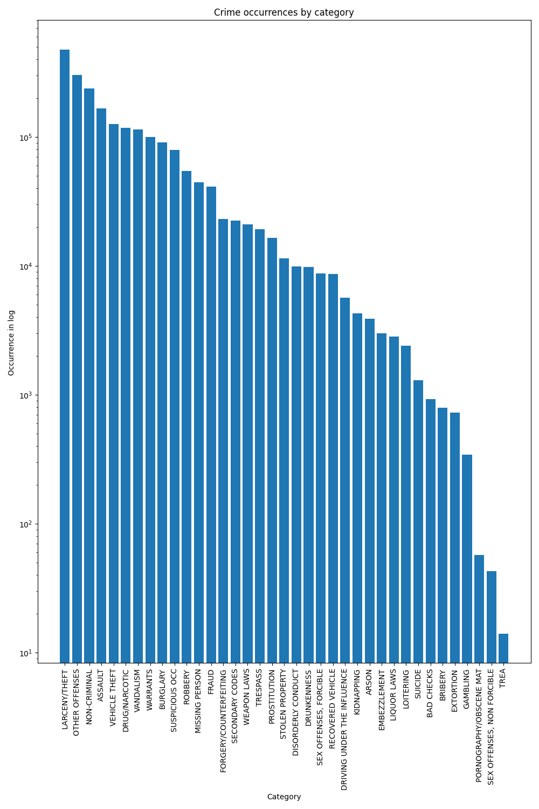

## Exercise
* Create a version of this plot from Week 1, where you display the `-axis on log-scale`. Comment on what the plot looks like. Do any new insights arise?

### From week1:

### Log scale:

* Plot the distribution of vs on linear axes & the distribution of vs on loglog axes.
### Distribution

